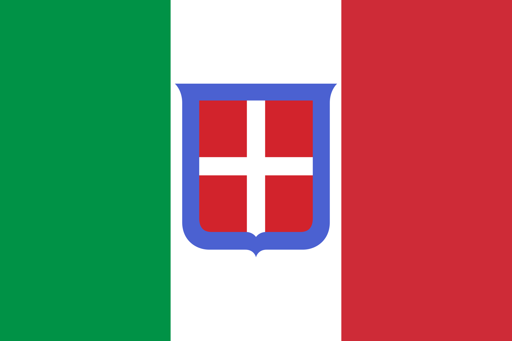
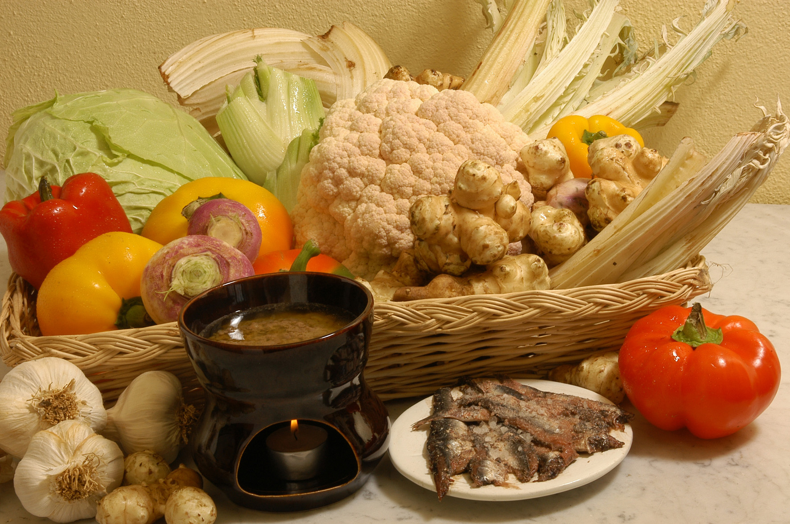
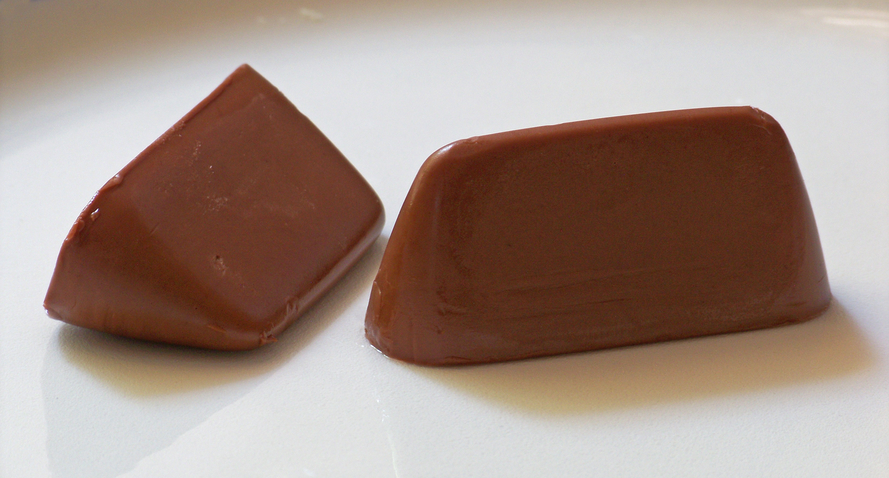
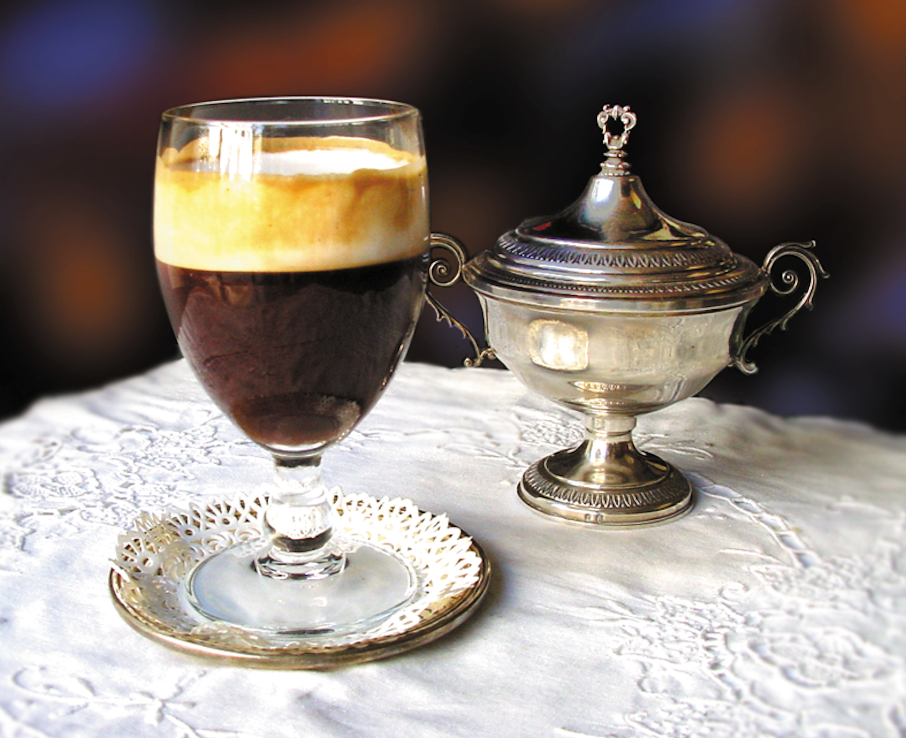
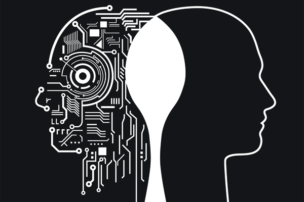
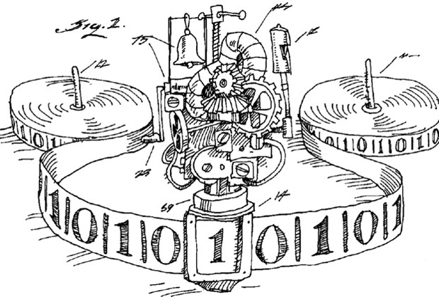
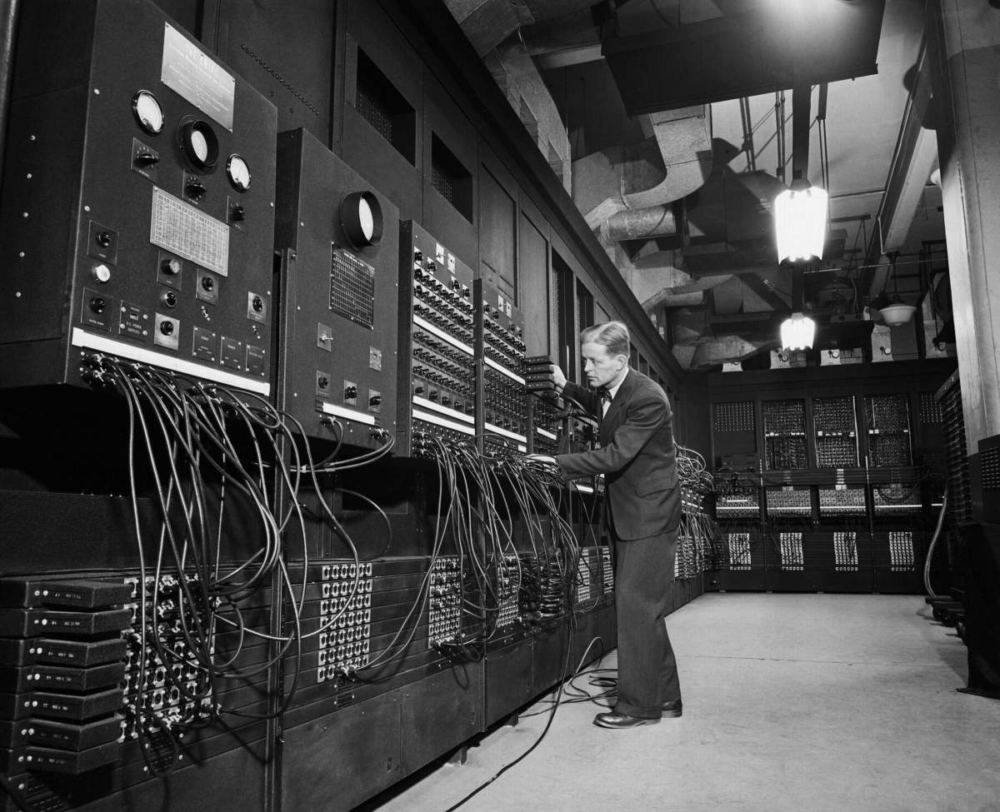

---

# Hi!

---

## I'm Ju 🙇🏻

---

## [fit] I work for *AlphaSights*
## [fit] We do Ruby, EmberJS & Elixir*
#### *I have T-shirts!

---

## I love Ruby 

---

## I love Turin

---

# TORINO

---

# Toe-rhee-no

---

## Turin is famous for many things

---

## It once was the capital of the Kingdom of Italy

---

## James Bond's old time favourite

---

---

---

## We have some pretty amazing delicatessen

---

---

# [fit] Bun-nya Cow-duh

---

---

# [fit] Jan-doo-yottoe

---

---

# [fit] Bee-chey-reen

---

## We have contributed a LOT to computing

---

# [fit] Turin Test

---

# [fit] Turin Machine

---

# [fit] Turin Complete

